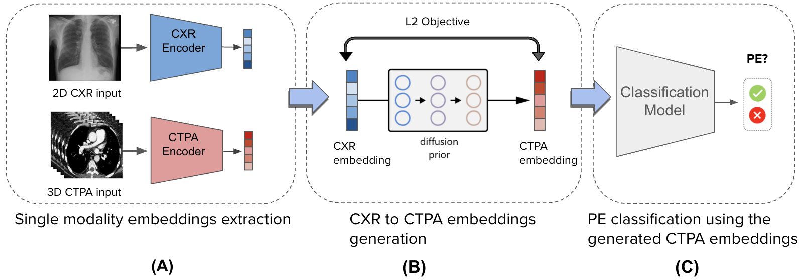

# Cross-Modal_CXR-CTPA_Knowledge_Distillation
This repository contains the scripts and models used in the paper Cross-Modal CXR-CTPA Knowledge Distillation using latent diffusion priors towards CXR Pulmonary Embolism Diagnosis.

# Introduction

Pulmonary Embolism (PE) is a life-threatening condition. Computed tomography pulmonary angiography (CTPA) is the gold standard for PE diagnosis, offering high-resolution soft tissue visualization
and three-dimensional imaging. However, its high cost, increased radiation exposure, and limited accessibility restrict its widespread use. In this work, we aim to introduce 
faster diagnosis opportunities by using 2D chest X-ray (CXR) data. CXR provides only limited two-dimensional visualization and is not typically used for PE diagnosis due to its inability to 
capture soft tissue contrast effectively. Here, we develop a novel methodology that distills knowledge from a trained CTPA-based teacher classifier model embedding to a CXR-based student embedding,
by feature alignment - leveraging paired CTPA and CXR features as supervision, which can be readily acquired. This enables us to train without requiring annotated data. 
Our approach utilizes a latent diffusion model to generate CTPA-based PE classifier embeddings from CXR embeddings. In addition, we show that incorporating cross-entropy loss together with 
the corresponding loss of the teacher-student embeddings increases performance, bringing it close to clinical-level performance. We show state-of-the-art AUC in a PE categorization task using only the initial CXR input. 
This approach broadens the diagnostic capabilities of CXRs by enabling their use in PE classification, thereby extending their applicability beyond traditional imaging roles.


Our suggested model is presented below:




# Results
We compare the average AUC scores (with a 95% confidence interval) of the PE classification from X-ray and CTPA only baselines and the Generated CTPAs embeddings on our test set. 

|    Model                                     |       AUC       | Accuracy | Specificity | Sensitivity  |
|----------------------------------------------|-----------------|----------|-------------|--------------|
|CTPA only classifier                          |0.85 [0.77-0.94] | 0.8      | 0.8         |   0.82       |
|X-ray only classifier                         |0.69 [0.54-0.77] | 0.71     | 0.70        |   0.73       |
|Cross-Modal CXR-CTPA Knowledge Distiallation  |0.82 [0.72-0.93] | 0.73     | 0.73        |   0.73       |

# Training

For training our model you would need to following missing parts:
1. Input embeddings (in our case the 1D CXR embeddings)
2. Output embeddings (in our case the 1D CTPA embeddings)
3. Classification model which operates on the output embeddings.

Once you've set up these 3 parts you would need to add them in the corresponding places in the code:
The path to the input/ output embedding directory in the datasets files
The classification model loading in the classification loss file.

At this point training the model can be done using the following command:

```
Python3 train_diffusion_prior.py
```

Please note that additional configs can be controlled in the train_prior_config.json file under configs directory


# Acknowledgement
This code is heavily built on the following repository:

https://github.com/lucidrains/DALLE2-pytorch

